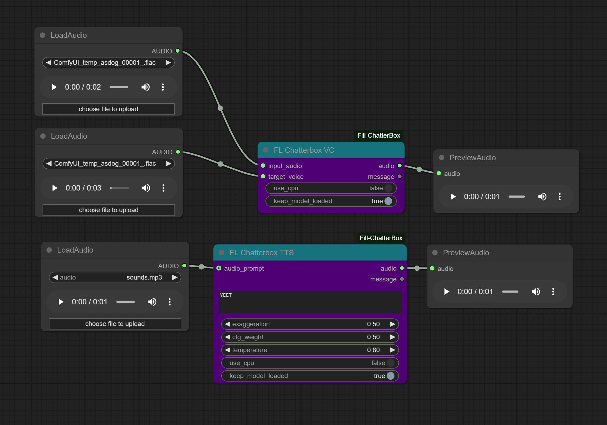

# ComfyUI_Fill-ChatterBox

A custom node extension for ComfyUI that adds text-to-speech (TTS) and voice conversion (VC) capabilities using the Chatterbox library.

## ✨ Enhanced Features

### 🔥 **NEW: Extended Text Support with Auto-Chunking**
- **No more 40-second limitation!** Process texts of any length
- **Smart text chunking:** Automatically splits long texts into 130-word chunks for optimal model stability
- **Seamless audio concatenation:** Chunks are processed individually and merged into one continuous audio output
- **Consistent voice cloning:** Same reference audio is used across all chunks for voice consistency
- **Progress tracking:** Visual progress bar shows chunk processing status



## Features

### Text-to-Speech Node (FL Chatterbox TTS)
- **Extended text processing:** Handle texts longer than the original 40-second limit
- **Automatic chunking:** Text is intelligently split into manageable segments
- **Voice cloning:** Use audio prompts for consistent voice replication across all chunks
- **Seamless output:** Individual audio chunks are concatenated into one continuous stream
- **GPU/CPU support:** Automatic fallback and device optimization
- **Persistent model loading:** Optional model caching for faster subsequent generations

### Voice Conversion Node (FL Chatterbox VC)
- Convert any voice to match a target voice sample
- CPU fallback if CUDA errors occur
- Efficient model management with optional persistence

## Installation

1. Clone this repository into your ComfyUI custom_nodes directory:
   ```bash
   cd /path/to/ComfyUI/custom_nodes
   git clone https://github.com/filliptm/ComfyUI_Fill-ChatterBox.git
   ```

2. Install the base dependencies:
   ```bash
   pip install -r ComfyUI_Fill-ChatterBox/requirements.txt
   ```

## Usage

### Text-to-Speech Node (FL Chatterbox TTS)
- Add the "FL Chatterbox TTS" node to your workflow
- **Input long texts:** No need to manually split - the node handles it automatically
- Configure parameters:
  - `exaggeration`: Controls emotion intensity (0.25-2.0)
  - `cfg_weight`: Controls pace/classifier-free guidance (0.2-1.0) 
  - `temperature`: Controls randomness in generation (0.05-5.0)
- Optionally provide an audio prompt for voice cloning
- **Monitor progress:** Watch the progress bar as each chunk is processed
- **Get seamless output:** Receive one continuous audio file regardless of input length

### Voice Conversion Node (FL Chatterbox VC)
- Add the "FL Chatterbox VC" node to your workflow
- Connect input audio and target voice
- Both nodes support CPU fallback if CUDA errors occur

## Technical Details

### Text Chunking Algorithm
- Splits input text by word boundaries
- Maximum 130 words per chunk (optimized for model stability)
- Preserves sentence structure where possible
- Handles edge cases (empty text, very short text)

### Audio Concatenation
- Uses PyTorch tensor concatenation for efficiency
- Maintains consistent sample rate (16kHz) across chunks
- No audio artifacts at chunk boundaries
- Single continuous waveform output

### Performance Optimizations
- Model persistence across chunks (optional)
- GPU memory management with automatic cleanup
- Progress tracking for long text processing
- Efficient tensor operations for concatenation

## Change Log

### Latest (Fork Enhancement)
- **🚀 MAJOR:** Removed 40-second text limitation through intelligent chunking
- **✨ NEW:** Automatic text splitting into 130-word segments
- **✨ NEW:** Seamless audio concatenation of processed chunks
- **✨ NEW:** Enhanced progress tracking for chunk processing
- **🔧 IMPROVED:** Better error handling for long text processing
- **🔧 IMPROVED:** Optimized memory usage for extended generation

### 5/31/2025
- Added Persistent model loading, and loading bar functionality
- Added Mac support (needs to be tested so HMU)
- Removed the chatterbox-tts library and implemented native inference code

## Limitations & Considerations

- **Processing time:** Longer texts will take proportionally longer to process
- **Memory usage:** Large texts may require more VRAM/RAM for model operations  
- **Prosody:** While voice consistency is maintained, natural speech flow across chunk boundaries may vary slightly
- **Optimal chunk size:** 130 words provides the best balance of stability and natural speech flow

## Contributing

This fork focuses on extending text processing capabilities. Feel free to contribute improvements to:
- Chunk boundary optimization
- Audio blending techniques
- Performance enhancements
- Additional safety features
